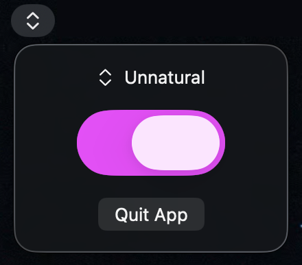

# Unnatural

A tiny macOS menu bar app that toggles **natural scrolling** on and off.

Click the chevron icon in the menu bar, then flip the switch:

- **On** — traditional scrolling
- **Off** — natural scrolling (macOS default)

Quit from the popover, or press ⌘Q.
